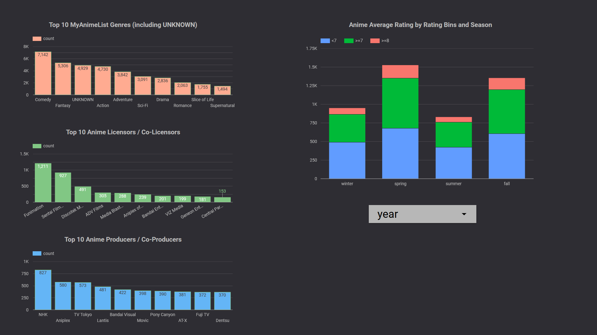

# MyAnimeList Data Insights

## Description

The project seeks to acquire insights and develop dashboards with anime data from [MyAnimeList](https://myanimelist.net/). According to their website description, MyAnimeList is *"the world's most active online anime and manga community and database"*.

### Dataset

The dataset that will be utilized in the project will be a [kaggle dataset](https://www.kaggle.com/datasets/dbdmobile/myanimelist-dataset). The files that will be used from the dataset are the following:
- `anime-dataset-2023.csv` - *"This dataset contains comprehensive details of 24,905 anime entries."*
- `users-details-2023.csv` - *"This dataset comprises information on 731,290 users registered on the MyAnimeList platform. It is worth noting that while a significant portion of these users are genuine anime enthusiasts, there may be instances of bots, inactive accounts, and alternate profiles present within the dataset."*
- `users-score-2023.csv` - *"This dataset comprises anime scores provided by 270,033 users, resulting in a total of 24,325,191 rows or samples."*

### Problem Description

This project aims to answer the following questions regarding the dataset:
- What are the most common genres in anime?
- Which licensors have the most anime licensed/co-licensed?
- Which producers or co-producers are prevalent among the anime industry?
- How does the average anime ratings vary between seasons?

### Pipeline


## Installation

The following programs need to be installed assuming the user does not already have the said programs present on their computer.
- [Docker](https://docs.docker.com/get-docker/)
- [Git](https://github.com/git-guides/install-git)
- [Terraform](https://developer.hashicorp.com/terraform/install)
> [!TIP]
> On a windows machine, these programs can also be installed using a command-line interface (CLI) assuming [winget](https://github.com/microsoft/winget-cli) is [already installed](https://learn.microsoft.com/en-us/windows/package-manager/winget/).
> ```powershell
> winget install --id=Docker.DockerDesktop  -e
> winget install --id=Git.Git  -e
> winget install --id=Hashicorp.Terraform  -e
> ```
  
### GCP

1. Create a Google Cloud Project [via console](https://developers.google.com/workspace/guides/create-project#google-cloud-console).
2. [Set up Application Default Credentials](https://cloud.google.com/docs/authentication/provide-credentials-adc) using [service account keys](https://cloud.google.com/docs/authentication/provide-credentials-adc#local-key) by creating a JSON key [via console](https://cloud.google.com/iam/docs/keys-create-delete#iam-service-account-keys-create-console).
3. Grant the following roles:
    - Viewer
    - BigQuery Admin
    - Storage Admin
    - Storage Object Admin
    - Dataproc Administrator
4. [Check if billing is enabled](https://cloud.google.com/billing/docs/how-to/modify-project#confirm_billing_is_enabled_on_a_project) on the newly created project.

### Git

1. [Clone](https://docs.github.com/en/repositories/creating-and-managing-repositories/cloning-a-repository) the git repository

```bash
git clone https://github.com/nishiikata/de-zoomcamp-2024-mage-capstone.git
```

### Terraform

1. An alternative to configuring the [credentials](https://registry.terraform.io/providers/hashicorp/google/latest/docs/guides/provider_reference#authentication-configuration) of Google Provider inside the terraform block is by setting `GOOGLE_APPLICATION_CREDENTIALS` environment variable to the path of the JSON file.
2. Change directory into the terraform folder and configure the necessary [variables](https://developer.hashicorp.com/terraform/language/values/variables#variable-definitions-tfvars-files) needed to create a terraform plan.
> [!NOTE]  
> The `dev.tfvars` file can be used as reference to know what terraform variables needs to be configured.
> 
> Save the updated file as `terraform.tfvars` or any file name ending in `.auto.tfvars` so that terraform will automatically load the configuration by default.
3. [Create a Terraform Plan](https://developer.hashicorp.com/terraform/tutorials/cli/plan#create-a-plan).
> [!CAUTION]
> It is recommend to just let terraform use the default values set in `locals.data_lake_bucket` and `var.bq_dataset_name`. Otherwise, values may need to be changed inside the mage orchestrator setup.

### Docker

1. Set the necessary environment variables required for docker compose in an `.env` file.
> [!NOTE]  
> The `dev.env` file can be used as reference to know what environment variables needs to be configured.
>
> The following google related environment variables provisioned by terraform may look like this
> ```env
> # GOOGLE_APPLICATION_CREDENTIALS does not have to be set inside the .env file
> # if it was already set on the current operating system
> # during the terraform configuration process
> GCS_BUCKET="myanimelist_data_lake_[YOUR PROJECT]"
> GCLOUD_PROJECT=[YOUR PROJECT]
> ```
2. Run the `gcs_connector.sh` script to [download](https://storage.googleapis.com/hadoop-lib/gcs/gcs-connector-hadoop3-latest.jar) a jar file that will enable pyspark app to [connect](https://cloud.google.com/dataproc/docs/concepts/connectors/cloud-storage) to Google Cloud Storage (GCS).
3. [Start](https://docs.docker.com/reference/cli/docker/compose/up/) the docker container via `docker compose up`


## Usage

### Starting the Mage Pipeline
Only the `initial_pipeline` pipeline needs to be manually started. The remaining pipelines are set to be automatically triggered [from a block](https://docs.mage.ai/orchestration/triggers/trigger-pipeline). The `initial_pipeline` can be triggered through any of the following:
- Using Mage UI ([Schedule](https://docs.mage.ai/design/core-abstractions#schedule) with *Run exactly once*)
- Executing the provided `start_initial_pipeline.sh` script.
> [!IMPORTANT]
> The [jq](https://jqlang.github.io/jq/download/) command-line tool is required to use the `start_initial_pipeline.sh` script I wrote since processing JSON objects on a CLI without it is so painful otherwise 🙃😭. You can just run the `initial_pipeline` manually if you can't install jq on your machine.
> 
> On windows you can also install jq via winget (This is the method I used on my personal windows machine.)
> ```powershell
> winget install --id=jqlang.jq  -e
> ```
> For other operating systems such as Linux and MacOS and many more .etc, you can just use the official [download page](https://jqlang.github.io/jq/download/).

### Run Mage in Cloud VM
Refer to Mage AI documentation for instructions on how to deploy a Mage AI instance to cloud virtual machines such as [GCP Cloud Run](https://docs.mage.ai/production/deploying-to-cloud/gcp/setup).

### Dashboard



The Looker Studio dashboard can be found [here](https://lookerstudio.google.com/reporting/fe6f969e-bf31-474f-b8ff-1cd740bd6a60).
